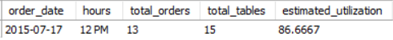

# Project-Pizza-Sales
 In this project I would like to showcase my technical skills using SQL & Power BI, as well as leveraging a multitude of soft-skills such as problem-solving and critical-thinking to achieve business objectives.

Check out SQL Code: [SQL Queries](sql_queries)

Check out Power BI Dashboard: [Pizza Sale Dashboard](/dashboard/)

## Table of Contents
- [Project-Pizza-Sales](#project-pizza-sales)
  - [Table of Contents](#table-of-contents)
  - [1. Introduction:](#1-introduction)
    - [1.1 Company Background](#11-company-background)
  - [2. Prepare Phase](#2-prepare-phase)
    - [2.1 Data Used](#21-data-used)
    - [2.2 Accessibility \& Usage of Data](#22-accessibility--usage-of-data)
    - [2.3 Data Limitations \& Integrity](#23-data-limitations--integrity)
    - [2.4 Tools and Methodologies](#24-tools-and-methodologies)
  - [3. Process Phase](#3-process-phase)
    - [3.1 Data Preparation](#31-data-preparation)
    - [3.2 Data cleaning](#32-data-cleaning)
    - [3.3 Data Normalization](#33-data-normalization)
    - [3.4 Data Transformation](#34-data-transformation)
  - [4. Exploratory Data Analysis (EDA)](#4-exploratory-data-analysis-eda)
    - [4.1 Business Task](#41-business-task)
      - [1. What days and times do we tend to be busiest?](#1-what-days-and-times-do-we-tend-to-be-busiest)
      - [2. How many pizzas are we making during peak periods?](#2-how-many-pizzas-are-we-making-during-peak-periods)
      - [3. What are our best and worst-selling pizzas?](#3-what-are-our-best-and-worst-selling-pizzas)
      - [4. What's our average order value?](#4-whats-our-average-order-value)
      - [5. How well are we utilizing our seating capacity?](#5-how-well-are-we-utilizing-our-seating-capacity)
  - [5. Further Analysis](#5-further-analysis)
    - [5.1 Sales Analysis](#51-sales-analysis)
      - [1. Month Over Month Growth Rates?](#1-month-over-month-growth-rates)
      - [2. What Pizza Category Generates the most revenue?](#2-what-pizza-category-generates-the-most-revenue)
      - [3. What Pizza Size Generates the most revenue?](#3-what-pizza-size-generates-the-most-revenue)
  - [6. Conclusion \& Recommendations](#6-conclusion--recommendations)

## 1. Introduction: 
### 1.1 Company Background
For the Maven Pizza Challenge, you’ll be playing the role of a BI Consultant hired by Plato's Pizza, a Greek-inspired pizza place in New Jersey. You've been hired to help the restaurant use data to improve operations, and just received the following note:

Welcome aboard, we're glad you're here to help!

Things are going OK here at Plato's, but there's room for 
improvement. We've been collecting transactional data for the past year, but really haven't been able to put it to good use. Hoping you can analyze the data and put together a report to help us find opportunities to drive more sales and work more efficiently.

Here are some questions that we'd like to be able to answer:

- What days and times do we tend to be busiest?
- How many pizzas are we making during peak periods?
- What are our best and worst-selling pizzas?
- What's our average order value?
- How well are we utilizing our seating capacity? (we have 15 tables and 60 seats)

That's all I can think of for now, but if you have any other ideas I'd love to hear them – you're the expert!

Thanks in advance,

Mario Maven (Manager, Plato's Pizza) 

## 2. Prepare Phase
### 2.1 Data Used 
The data source used for this Project is https://www.kaggle.com/datasets/shilongzhuang/pizza-sales.
This dataset was downloaded from Kaggle where it was uploaded by Shi Long Zhuang.

### 2.2 Accessibility & Usage of Data 
This public dataset is completely available on the Maven Analytics website platform where it stores and consolidates all available datasets for analysis in the Data Playground. The specific individual datasets at hand can be obtained at this link below: 
https://www.mavenanalytics.io/blog/maven-pizza-challenge

### 2.3 Data Limitations & Integrity
This Pizza Sales dataset contains 12 columns and a total of 48620 records:
- **order_id**: Unique identifier for each order placed by a table.
- **order_details_id**: Unique identifier for each order placed by a table.
- **pizza_id**: Unique key identifier that ties the pizza ordered to its details, like size and price.
- **quantity**: Quantity ordered for each pizza of the same type and size.
- **order_date**: Date the order was placed (entered into the system prior to cooking & serving).
- **order_time**: Time the order was placed (entered into the system prior to cooking & serving).
- **unit_price**: Price of the pizza in USD.
- **total_price**: Unit_price * quantity.
- **pizza_size**: Size of the pizza (Small, Medium, Large, X Large, or XX Large).
- **pizza_type**: Unique key identifier that ties the pizza ordered to its details, like size and price.
- **pizza_ingredients**: Ingredients used in the pizza as shown in the menu (they all include Mozzarella Cheese, even if not specified; and they all include Tomato Sauce, unless another sauce is specified).

The data is clean and well-maintained but somewhat limited:

There is not enough information to conduct an in-depth Inventory Analysis which provides real-time insights into inventory levels, stock movements, and related metrics that help to optimize supply chain operations and minimize costs which can ensure efficient stock levels.

There is also no Customer information for Customer Segmentation Analysis, a process of dividing a company's customers into groups based on shared characteristics to better tailor marketing and sales efforts. So there may be limited understanding of customer behavior, hindering targeted marketing efforts.

### 2.4 Tools and Methodologies
**Tools:**

- **MYSQL:** Our Database Management System used for preparing and querying the data for Exploratory Date Analysis.

- **Power BI:** Our BI tool for building a dashboard and any other visualizations.

- **Git & GitHub:** Crucial for version control and sharing
SQL scripts and analysis, ensuring project tracking and potential collaboration.

- **Visual Studio Code:** For managing Git repositories committing changes, and handling branches.

**Methodolgies:**

- **Descriptive analysis:** Our main focus here is to describe, summarize, interpret, and present the main features (characteristics, patterns, and trends) of the dataset in a meaningful way without drawing conclusions beyond the data itself.

- **Time-series analysis:** Here we will identify trends over time and seasonal patterns, to draw insights.

## 3. Process Phase
### 3.1 Data Preparation 
We start off by creating a new database called **pizza_db** in MYSQL and import the relevant csv file in which all 48620 
records were successfully imported. Something to note:
- The **order_date** and **order_time** 
columns are set as **TEXT** datatypes.
- The **unit_price** and **total_price** 
columns are set as **DOUBLE** datatype.

### 3.2 Data cleaning
As mentioned before the data is clean and well-maintained, there is not duplicates or empty values, so we begin by standardizing the data:

Firstly we set the **order_date** and **order_time** columns into the standard format MYSQL uses, and then we correct the datatype from **TEXT** to **DATE/TIME**.

Secondly, we set the **unit_price** and **total_price** columns as **DECIMAL** datatype.

```SQL
-- 2.STANDARDIZE DATA
UPDATE pizza_sales SET order_date = STR_TO_DATE(order_date, '%d/%m/%Y');
ALTER TABLE pizza_sales MODIFY order_date DATE;

UPDATE pizza_sales SET order_time = STR_TO_DATE(order_time, '%H:%i:%s');
ALTER TABLE pizza_sales MODIFY order_time TIME;

ALTER TABLE pizza_sales MODIFY unit_price DECIMAL(10, 2);
ALTER TABLE pizza_sales MODIFY total_price DECIMAL(10, 2);
```
### 3.3 Data Normalization
We organize the data into multiple related tables to improve data integrity and reduce redundancy.

1. **Order Table:** Tracks order information, like date and time.
2. **Pizza Table:** Stores pizza-specific details such as size, type, and ingredients.
3. **Order Details Table:** Links specific pizzas to an order, including quantity and prices.

```sql
CREATE TABLE Orders (
    order_id INT NOT NULL PRIMARY KEY AUTO_INCREMENT,
    order_date DATE NOT NULL,
    order_time TIME NOT NULL
);

CREATE TABLE Pizzas (
    pizza_id INT NOT NULL PRIMARY KEY AUTO_INCREMENT,
    pizza_name VARCHAR(50) NOT NULL,
    pizza_size VARCHAR(50) NOT NULL,
    pizza_category VARCHAR(100) NOT NULL,
    pizza_ingredients TEXT NOT NULL
);

CREATE TABLE OrderDetails (
    order_details_id INT NOT NULL PRIMARY KEY AUTO_INCREMENT,
    order_id INT NOT NULL,
    pizza_id INT NOT NULL,
    quantity INT NOT NULL,
    unit_price DECIMAL(10, 2) NOT NULL,
    total_price DECIMAL(10, 2) NOT NULL,
    FOREIGN KEY (order_id) REFERENCES Orders(order_id),
    FOREIGN KEY (pizza_id) REFERENCES Pizzas(pizza_id)
);
```

<details>
<summary>And then insert the data into the corresponding tables:
</summary>

```sql
INSERT INTO Orders (order_date, order_time)
SELECT order_date, order_time
FROM pizza_sales;

INSERT INTO Pizzas (pizza_name, pizza_size, pizza_category, pizza_ingredients)
SELECT pizza_name, pizza_size, pizza_category, pizza_ingredients
FROM pizza_sales;

INSERT INTO OrderDetails (order_id, pizza_id, quantity, unit_price, total_price)
SELECT 
    o.order_id, 
    p.pizza_id, 
    ps.quantity, 
    ps.unit_price,
    ps.total_price
FROM pizza_sales ps
JOIN Orders o ON ps.order_details_id = o.order_id
JOIN Pizzas p ON ps.order_details_id = p.pizza_id;
```

</details>

**Order table:**


**Pizza table:**


**Orderdetails table:**


### 3.4 Data Transformation
<details>
<summary>In this section we fine-tune the data for visualization and analysis purposes.
</summary>

```sql
-- Rename values for visualization purposes
UPDATE Pizzas
SET pizza_size =
	CASE
		WHEN pizza_size = 'S' THEN 'Small'
        WHEN pizza_size = 'M' THEN 'Medium'
        WHEN pizza_size = 'L' THEN 'Large'
        WHEN pizza_size = 'XL' THEN 'XLarge'
        WHEN pizza_size = 'XXL' THEN 'XXLarge'
	END;

-- Add days_of_week column to Orders
ALTER TABLE Orders
ADD COLUMN days_of_week VARCHAR(20);

UPDATE Orders
SET days_of_week = DAYNAME(order_date)
WHERE order_id IS NOT NULL;

-- Add times_of_day column to Orders
ALTER TABLE orders
ADD COLUMN times_of_day VARCHAR(20);

UPDATE Orders
SET times_of_day = (
	CASE 
		WHEN order_time BETWEEN '00:00:00' AND '11:59:59' THEN 'Morning' 
		WHEN order_time BETWEEN '12:00:00' AND '14:59:59' THEN 'Lunch'
		WHEN order_time BETWEEN '15:00:00' AND '17:59:59' THEN 'Afternoon' 
		WHEN order_time BETWEEN '18:00:00' AND '20:59:59' THEN 'Dinner'
		WHEN order_time BETWEEN '21:00:00' AND '23:59:59' THEN 'Late Evening' 
	END)
WHERE order_id IS NOT NULL;

# Add day_category column to Orders
ALTER TABLE Orders
ADD COLUMN day_category VARCHAR(20);

UPDATE Orders
SET day_category = CASE
    WHEN days_of_week IN ('Monday', 'Tuesday', 'Wednesday', 'Thursday', 'Friday') THEN 'Weekday'
    WHEN days_of_week IN ('Saturday', 'Sunday') THEN 'Weekend'
END;
```
</details>

## 4. Exploratory Data Analysis (EDA)
### 4.1 Business Task
In this section we will be focusing on the main task of providing answers to the specific questions given by Plato's Pizza.

#### 1. What days and times do we tend to be busiest?
The metric used to determine how busy the restaurant is, will be the number of total orders. 

```SQL
SELECT COUNT(order_id) AS total_orders FROM orders;
```


**1.1 Busiest Days?**

```sql
SELECT 
    DISTINCT days_of_week,
    COUNT(*) AS total_orders
FROM orders
GROUP BY days_of_week
ORDER BY total_orders DESC;
```


**Insight:**
Friday appears to be the busiest day throughout the year and
Sunday the least busiest day.

**Trend:** Total Orders progressively increase from the start of the week, Monday, and peaks Friday-Saturday, and diminishes at the end of the week on Sunday.

**1.2 Busiest Times?**

```sql
SELECT 
	DATE_FORMAT(order_time, '%h %p') AS hour_of_day,
    COUNT(*) AS total_orders
FROM orders
GROUP BY hour_of_day
ORDER BY total_orders DESC;
```


**Insight:**
Lunch time (12PM to 3PM) and Dinner time (6PM to 8PM) appear to be the most popular hours.

On the other hand, Early Mornings (09AM to 10AM) and Late-night (11PM) make up a total of 89 orders out of 48,620 making them the least popular hours.

**1.3 Busiest Day and time?**

```sql
-- busiest times across the week (day + hour breakdown)
SELECT 
    days_of_week, 
    DATE_FORMAT(order_time, '%h %p') AS hour_of_day, 
    COUNT(*) AS total_orders
FROM orders
GROUP BY days_of_week, hour_of_day
ORDER BY total_orders DESC;
```


*Top 10 results out of 95 rows*

**Insight:**
Thursday at 12PM is the busiest time throughout the year 
and Sunday at 10AM is the least busiest Time (not shown in image). This further suggests that regardless of the day, the hours between 12PM and 1PM are peak times for pizza orders.

What does all this mean in terms of revenue?


*from pizza sales Dashboard*

In the peak hours of 12PM and 1PM where the restaurant is most busiest a total Revenue of $217,944 was generated.

The least busiest hours; 09AM, 10AM, and 11PM make a combined total revenue of $1,508 of $817,859.

**Recommendations:**

**Optimise Opening-Closing times:**
It may be best practice to open at 11AM and close at 11PM to save costs and boost efficiency.

**Staffing Optimization:**
During Peak days like Friday and Saturday ensure there are 
sufficient staff and resources available to meet the demand. 
You may want to consider increasing shifts, hire temporary workers, or adjust employee schedules to cover peak periods.

During Off-Peak Days like Sunday and Monday these days may be ideal for maintenance and training.

**Marketing & Promotions:**
Running time-sensitive promotions during Peak times can help 
maximize sales by offering Lunch time or Dinner time discounts.

There's also the opportunity to drive sales through combo deals to help upsell or cross-sell during peak hours.

**Busiest Month?**

```sql
SELECT 
    DISTINCT MONTHNAME(order_date) AS months,
    COUNT(*) AS total_orders
FROM orders
GROUP BY months
ORDER BY total_orders DESC;
```


**Insight:**
Although July is the peak month for orders, there doesn't seem to be a distinct seasonal pattern as total orders fluctuates by month. This means that sales are unaffected my seasonal change or holidays.

Eight out of the twelve months have recorded over 4,000 
total orders which is a good indicator of steady demand throughout the year.

**Recommendations:**

**Marketing & Promotions:**
Seasonal promotions during occasions like Christmas, New Year, Easter, and Halloween can boost sales by providing festive-themed products or seasonal discounts, such as Winter Sales.

#### 2. How many pizzas are we making during peak periods?

```sql
SELECT
	DISTINCT times_of_day AS peak_periods,
    SUM(od.quantity) AS number_of_pizzas_sold
FROM orders o
JOIN orderdetails od ON o.order_id = od.order_id
GROUP BY times_of_day
ORDER BY number_of_pizzas_sold DESC;
```


**Insight:**

- **Peak Periods:** Lunch Time (12PM to 3PM) and Dinner Time (6PM to 9PM) have the highest demand for pizza. This may be due to the fact most people don't skip these meal times. Another reason may be because pizza is considered a convenient meal or a comfort pick. 

- **Afternoon Sales:** 12,666 pizzas sold in the afternoon indicate strong demand between 3PM to 6PM. This amount is nearly on par with dinner sales, with only 691 pizzas separating the two periods.

- High demand may be due to the fact that the Afternoon is between Lunch and Dinner, which could suggest a robust snack culture, people who take late lunches, or a tendency for early dinners.

- **Least Popular Periods:** Late Evening demand drops significantly down to 3,999, while Morning demand have also dipped to 2,750. This decline could be because pizza isn't typically a popular option for late-night or early-morning meals.

**Recommendations:**

- **Menu Expansion:** 
Introduce breakfast-friendly or late-night-friendly pizza options to increase demand during these periods.

- **Marketing & Promotion:** Similarly, as mentioned before 
time-sensitive promotions can help boost sales. Consider targeted marketing for night-owls and early-birds to boost sales during Late-Evenings and Mornings.

#### 3. What are our best and worst-selling pizzas?

**Best Selling Pizzas:**

```sql
-- Best selling pizzas
SELECT p.pizza_name, 
       SUM(od.quantity) AS total_sold
FROM orderdetails od
JOIN pizzas p ON od.pizza_id = p.pizza_id
GROUP BY p.pizza_name
ORDER BY total_sold DESC
LIMIT 5;
```


**Insight:**
Although the best selling pizza is the 'Classic Deluxe Pizza'
with 2453 pizzas sold, the top four pizzas have achieved 
comparable sales, each exceeding 4,000 units sold.

**Worst Selling Pizzas:**

```sql
-- Worst selling pizzas
SELECT p.pizza_name, 
       SUM(od.quantity) AS total_sold
FROM orderdetails od
JOIN pizzas p ON od.pizza_id = p.pizza_id
GROUP BY p.pizza_name
ORDER BY total_sold ASC
LIMIT 5;
```


**Insight:**
The 'Brie Carre Pizza' has consistently been the least popular option, with just 490 sold over the entire year. Additionally, the next four pizzas on the list have also struggled, failing to reach the 1,000 pizza sales mark.

**Recommendation:**
It is worth considering to remove 'Brie Carre Pizza' from the menu altogether and focus on raising the minimum quantity of Pizzas sold over the 1,000 pizzas sold benchmark.

#### 4. What's our average order value?

```sql
SELECT 
    ROUND(SUM(od.quantity * od.unit_price) / COUNT(DISTINCT o.order_id), 2) AS average_order_value,
    MIN(unit_price), MAX(unit_price)
FROM orderdetails od
JOIN orders o ON od.order_id = o.order_id;
```


**Insight:**
The Average Order Value is 16.82. This appears to be on the lower side, especially when the cheapest item is priced at 9.75 and the most expensive is 35.95, resulting in a difference of 26.20.

It seems that customers typically order one pizza and often 
opt for the more affordable options.

**recommendation:**
Highlight Affordable Options: Feature your best-value pizzas 
prominently on the menu, making it easier for customers to find and choose them.

#### 5. How well are we utilizing our seating capacity? 
(we have 15 tables and 60 seats)

To undercover how effectively the seating capacity is being 
utilized without a dedicated dataset to provide this information we must first must make a few assumptions in order to reach an accurate estimation.

Secondly, using what we know; July (month), Friday (day), and 12 PM (hour) are the busiest periods in their respective
segmentations. Therefore, we have picked '2015-07-17' which contains all the busiest periods in one date.

**Ultilizing Seating Capacity Based On Number Of Table:**

```sql
-- With the assumption each table serves one order at a time.
SELECT 
    order_date,
    DATE_FORMAT(order_time, '%h %p') AS hours,
    COUNT(DISTINCT order_id) AS total_orders,
    '15' AS total_tables,
    (COUNT(DISTINCT order_id) / 15) * 100 AS estimated_utilization
FROM orders
WHERE order_date = '2015-07-17'
	AND DATE_FORMAT(order_time, '%h %p') = '12 PM'
GROUP BY order_date, hours;
```



**Insight:**
During the busiest period, only 13 of the 15 tables are being used, amounting to 86% use rate.

**Ultilizing Seating Capacity Based On Average Party Size Per Order:**

```sql
-- With the assumption an average party size per order is 2.5 we can estimate how many seats were occupied:
SELECT 
    order_date,
    DATE_FORMAT(order_time, '%h %p') AS hours,
    COUNT(order_id) AS total_orders,
    '60' AS total_seats,
    (COUNT(order_id) * 2.5) AS estimated_seats_used,
    ((COUNT(order_id) * 2.5) / 60) * 100 AS seat_utilization_percentage
FROM orders
WHERE order_date = '2015-07-17'
	AND DATE_FORMAT(order_time, '%h %p') = '12 PM'
GROUP BY order_date, hours;
```


**Insight:**
Approximately only 54% of seats are being occupied during peak season, with the assumption that the average group per order is 2.5 people.

**Recommendation:**
With 15 tables available and a total of 60 seats, it is
reasonable to conclude that each table accommodates 4 people.
It might be worthwhile reviewing seating Arrangements to assess whether the layout can be adjusted to accommodate more guests or smaller parties without sacrificing comfort.

- Maximize table usage by having more smaller sized tables.

## 5. Further Analysis

Previously, we mainly focused on answering the specific questions at hand. In this section we will be combining SQL queries and a Pizza Sales Dashboard created in Power Bi; Highlighting key metrics and visualizations to uncover more insights.

### 5.1 Sales Analysis
Link to Power BI Dashboard: [Pizza Sale Dashboard](/dashboard/)


#### 1. Month Over Month Growth Rates?

```sql
WITH monthly_revenue AS (
    SELECT 
        DATE_FORMAT(order_date, '%m') AS `month`,
        SUM(total_price) AS total_revenue
    FROM orders o
    JOIN orderdetails od ON o.order_id = od.order_id
    GROUP BY DATE_FORMAT(order_date, '%m')
)
SELECT 
    `month`,
    total_revenue,
    LAG(total_revenue) OVER (ORDER BY `month`) AS prev_revenue,
    ROUND(((total_revenue - LAG(total_revenue) OVER (ORDER BY `month`)) 
            / LAG(total_revenue) OVER (ORDER BY `month`)) * 100, 2) AS mom_growth
FROM monthly_revenue
ORDER BY `month`;
```


**Insight:**
There is no noticeable deviation from the average value ($68.16k).
- **Strong Growth Period:** November had the highest growth at 9.95%
- **Significant Drops:** December has the highest decline in revenue at -8.09%.

None of which exceed the 10% mark, indicating stable stream of revenue flowing in.

#### 2. What Pizza Category Generates the most revenue?


*from Pizza Sales Dashboard*

**Insight:**
The Classic Pizzas brings in the highest revenue, making up 26.91% of the total earnings, whereas the Veggie Pizzas bring in the least amount of revenue with 23.68% of revenue made. That is 3.23% variance which denotes that revenue distribution across pizza categories are relatively even.

**Balanced Customer Demand:** 
The even distribution implies that no particular category 
significantly dominates sales, indicating a well-rounded menu appeal.

**Diverse Customer Preferences:** 
Customers have diverse preferences, leading to a steady demand across all pizza categories.

**Stable Revenue Streams:**
Diverse and evenly distributed revenue streams ensure that the company doesn’t rely heavily on any one category, thus reducing overall risk.

**Recommendation:**

**Optimize Inventory Management:** Since demand is even, ensure inventory stock align with the balanced sales patterns to reduce waste and cost.

#### 3. What Pizza Size Generates the most revenue?


*from Pizza Sales Dashboard*

**Insight:**
Large Pizzas contributes the most revenue at $375K (45.89%) and XXLarge Pizzas have the least revenue impact generating only $1K (0.12%). 

**Optimizing Large and Medium Sizes:** 
Large and Medium size pizzas account for 76.38% of total revenue. This suggests that they are the most popular and may have higher price points.

**Small Pizzas Potential:** 
Given that small pizzas account for more than 20% of revenue, we could explore the possibility of bundling them with other items on the menu (drinks or sides) to boost the average order value.

**Re-evaluate X-Large & XX-Large Pizzas:** 
The combined revenue from both sizes is extremely low, contributing less than 2% to overall revenue. It may not be worth continuing production to reduce costs.

## 6. Conclusion & Recommendations
Plato' Pizza main goal is to improve operations, drive more sales and work more efficiently. The transactional data provided by them contains information solely based on their pizza products.

**Sales Performance Overview:**

- During the entire year, July was the standout month, recording the highest total orders at 4,301 and generating the highest revenue of $73,000. On the other hand, October recoreded the lowest orders at 3797 and the lowest revenue of $64,028. That is a difference of 504 orders and $9,000 of revenue.

- On average $68,000 was generated each month with November having the highest growth rate at 9.95% and December having the highest decline in revenue at -8.09%, none of which exceed the 10% mark.

- Overall Revenue and orders are very stable throughout the year, 8 of 12 months have recorded over 4,000 total orders, suggesting demand is unaffected my seasonal change or holidays.

*Recommendations:*

- **Marketing & Promotions:** Seasonal promotions during occasions like Christmas, New Year, Easter, and Halloween
can boost sales by providing festive-themed products or seasonal discounts, such as Winter Sales.

- **Optimize Inventory Management:** Since demand is even, ensure inventory stock align with the balanced sales patterns to reduce waste and cost.

**Efficieny Overview:**

- Orders progressively increase from Monday, peak on Friday-Saturday, and diminishes on Sunday.

- Demand for pizza peaks during Lunch Time (12PM to 3PM) and Dinner Time (6PM to 9PM), with the highest revenue generated during 12 PM and 1 PM ($217,944).

- Demand for pizza is significantly lower during Late-evening and Early-morning hours, with just 89 orders placed from 9AM to 10AM and 11PM combined. These quieter times account for only a small fraction of revenue, totaling $1,508 out of $817,859.

*Recommendations:*

- **Menu Expansion:** Introduce breakfast-friendly or late-night-friendly pizza options to increase demand during these periods.

  - There's also the opportunity to drive sales through combo deals to help upsell or cross-sell during peak hours.

- **Marketing & Promotions:** Running time-sensitive promotions during Peak times can help maximize sales by offering Lunch time or Dinner time discounts.

  - Consider targeted marketing for night-owls and early-birds to boost sales during Late-Evenings and Mornings.

- **Optimise Opening-Closing times:** It may be best practice to open at 11AM and close at 11PM to save costs and boost efficiency.

- **Staffing Optimization:** During Peak days like Friday and Saturday ensure there are sufficient staff and resources available to meet the demand. You may want to consider increasing shifts, hire temporary workers, or adjust employee schedules to cover peak periods.

  - During Off-Peak Days like Sunday and Monday these days may be ideal for maintenance and training.

- **Seating Optimization:** Review seating arrangements to assess whether the layout can be adjusted to accommodate more guests or smaller parties without sacrificing comfort by maximizing table usage by having more smaller sized tables.

**Product Performance Overview:**

- The top 4 selling pizzas have comparable sales, each exceeding 4,000 units sold. Whereas, 'Brie Carre Pizza' has consistently been the least popular option, with just 490 sold over the entire year.

- The even distribution of sales across all 4 pizza categories indicates a well-rounded menu appeal, satisfying diverse customer preferences. This leads to stable revenue streams, minimizing reliance on any single category and reducing business risk.

- There are 5 pizza sizes ranging from Small to XXLarge. Large Pizzas contributes the most revenue at $375K (45.89%) and XXLarge Pizzas have the least revenue impact generating only $1K (0.12%). 

*Recommendations:*

- **Menu Optimization:** It is worth considering to remove 'Brie Carre Pizza' from the menu altogether and focus on raising the minimum benchmark of 1,000 pizzas sold.

- **Re-evaluate X-Large & XX-Large Pizzas:** The combined revenue from both sizes is extremely low, contributing less than 2% to overall revenue. It may not be worth continuing production to reduce costs.

- **Optimizing Large and Medium Sizes:** Large and Medium size pizzas account for 76.38% of total revenue. This suggests that they are the most popular and may have higher price points.

- **Small Pizzas Potential:** Given that small pizzas account for more than 20% of revenue, explore the possibility of bundling them with other items on the menu (drinks or sides) to boost the average order value.

- **Optimize Inventory Management:** Since demand is even, ensure inventory stock align with the balanced sales patterns to reduce waste and cost.